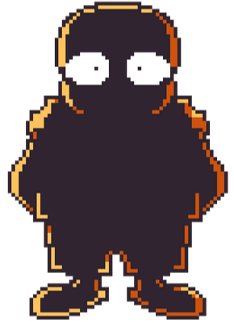
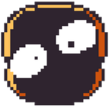
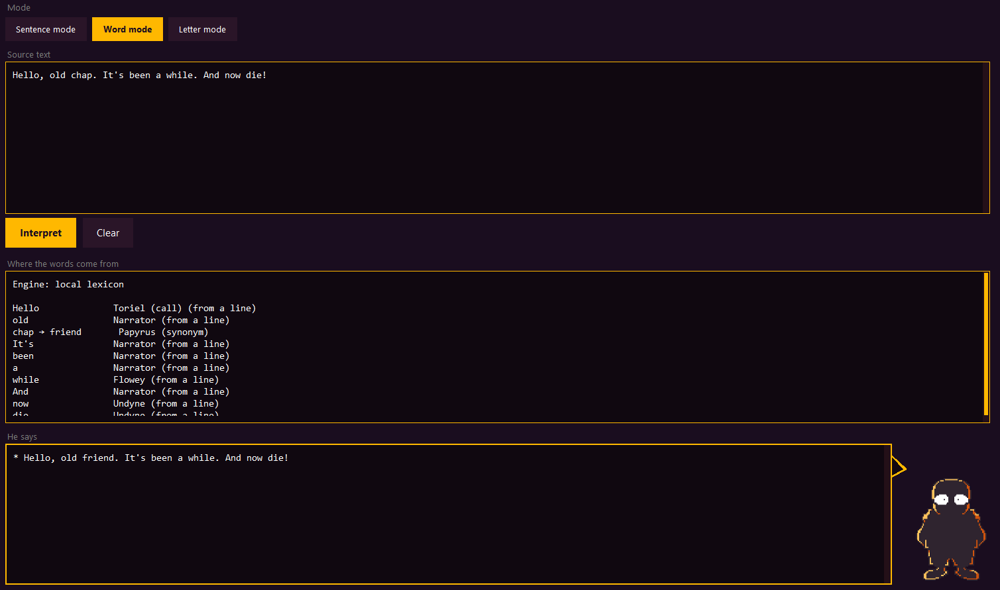
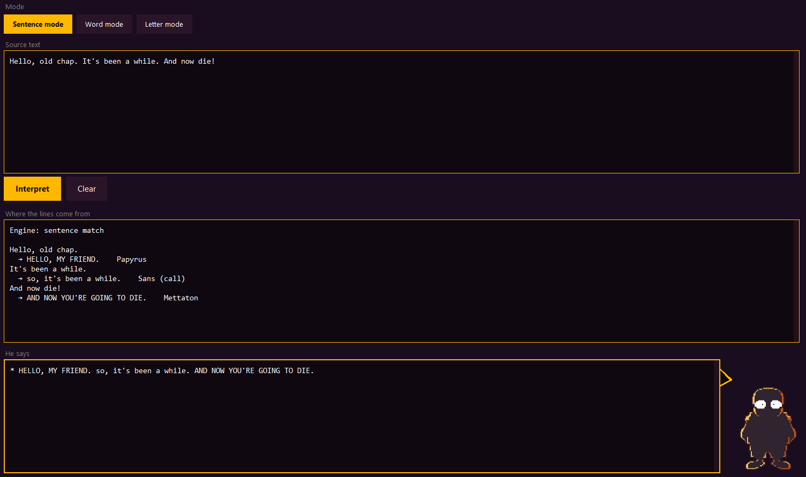
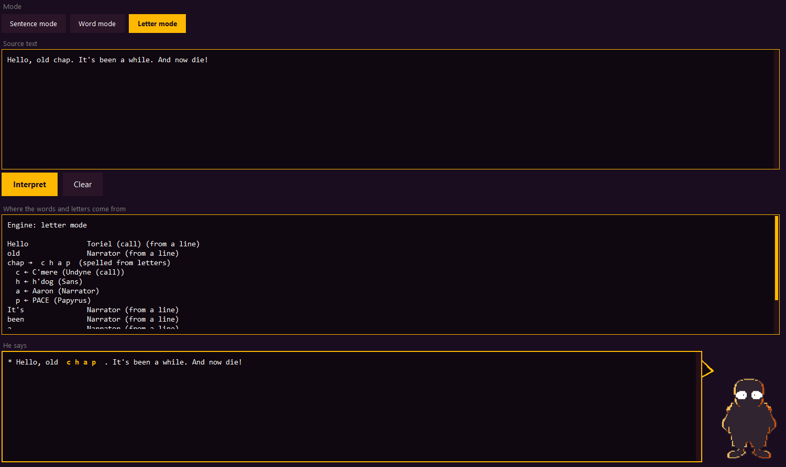
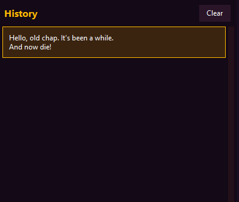

<p align="center">
  
</p>

**[English](#readme-en)** · **[Русский](#readme-ru)**

<p align="center">
  
</p>

**[Download the program](https://github.com/three3peaks/wiki-sans-lines/releases)**

---

<h1 id="readme-en">English</h1>

[Читать на русском](#readme-ru)


## About

Unlike many other characters in the Undertale fandom, **WIKI!Sans** stands out because he cannot reproduce speech or form sentences on his own. For his voice he uses every existing line from UNDERTALE — but most people remember only a small part of them.

The program exists to solve that. You write ordinary English. The program looks through the game's own words and lines and — depending on the mode — rebuilds the text the way WIKI!Sans would actually say it.

It can use [WordNet](https://wordnet.princeton.edu/) (a synonym dictionary) and a local [Ollama](https://ollama.com) **qwen2.5:7b** model when a word is still missing. Both modules are optional. The program still runs without them, but the result is thinner: fewer synonyms, more dropped words, less natural phrasing.

This is a **creative project under a free license**. You are free to take the code for your own ideas. Please just leave the credits to the authors.

<p align="center">
  
</p>


## Sources

| What | Who |
| --- | --- |
| **Character** | The WIKI!Sans character was created by [paintedhen](https://x.com/paintedhen). |
| **Dialogue** | Every in-game line comes from [HushBugger/hushbugger.github.io](https://github.com/HushBugger/hushbugger.github.io). Thanks to [HushBugger](https://github.com/HushBugger) for the pre-built line dump. |
| **Sprites** | All sprites used here belong to [ImXR24](https://www.deviantart.com/imxr24). Source: [Wiki Sans V2](https://www.deviantart.com/imxr24/art/Wiki-Sans-V2-1000594478) |

<p align="center">
  
</p>



## How to use

1. Open **WIKI!Sans lines** (the window, or `python main.py` from `wiki-sans/`).
2. Pick a mode at the top: **Sentence**, **Word**, or **Letter**.
3. Type or paste English into **Source text**.
4. Press **Interpret**.
5. Read **He says** — that is the rebuilt line — and the log above it.

The three modes are different ways of building WIKI!Sans's sentences.


### Word mode

**If WIKI built his own lines out of fragments of existing ones.**

The program walks your text token by token. For each word it tries, in order:

1. a word that already appears in an Undertale textbox
2. a nearby word from the local synonym graph
3. a WordNet neighbor, if WordNet is on and available
4. a rewrite from Ollama qwen, if Ollama is on and the word is still missing

It keeps punctuation and the shape of your sentence. It does not invent a brand-new vocabulary. If nothing close exists, that word is dropped rather than left unresolved.




### Sentence mode

**WIKI's original speech: using existing dialogues and lines.**

Sentence mode does **not** replace words one by one. It splits your text into sentences and, for each one, picks the closest full line from the Undertale corpus — by token and synonym overlap.




### Letter mode

**WIKI almost never talks this way. Missing words are built from letters taken from words in the lines.**

Known words are still taken from textboxes. An unknown word is **spelled** from letters that exist in other corpus words, shown with spaces between the letters (for example `c h a p`). The output marks those spelled pieces so you can see what was borrowed letter by letter.




### History

Every interpretation is saved as a card in the **History** panel.

Click a card to bring that run back: the source text, the spoken line, and the source log. History is stored next to the program in `history.json`, so it survives a restart. **Clear** empties the list.



<p align="center">
  
</p>


## Where the words come from

The program always shows its work.

Under **Where the words and letters come from** you can see which character said the line, and which textbox a word (or a spelled letter) was taken from.

<p align="center">
  
</p>


## Settings for the exe

If you downloaded the program from [Releases](https://github.com/three3peaks/wiki-sans-lines/releases), this is all you need.

Next to `WIKI!Sans lines.exe` there is a `config.json` file. Open it in any text editor, change the values, save, then restart the program. If the file is missing, the program creates it on launch.

```json
{
  "wordnet": true,
  "ollama": true,
  "ollama_host": "http://127.0.0.1:11434",
  "ollama_model": "qwen2.5:7b",
  "default_mode": "word"
}
```

| Key | What it does |
| --- | --- |
| `wordnet` | `true` / `false`. When `false`, WordNet is not used. |
| `ollama` | `true` / `false`. When `false`, the local model is not called. |
| `ollama_host` | Leave this as is unless you changed the Ollama address. |
| `ollama_model` | Model name. Default is `qwen2.5:7b`. |
| `default_mode` | Starting mode: `word`, `sentence`, or `letter`. |

Turn a module off if you have no network or the model is not installed. The status bar will say `off` instead of `no`.

**WordNet.** For the ready-made exe you only flip `"wordnet"` in `config.json`. The exe does not download WordNet by itself. If the status says `WordNet: no`, set it to `false`.

**Ollama.** Used only in **Word mode**, and only for words the program still cannot cover.

1. Install Ollama from the official site: [https://ollama.com](https://ollama.com)
2. Make sure the Ollama app is running (it usually sits in the system tray).
3. Download the model this program expects:

```bash
ollama pull qwen2.5:7b
```

4. Keep `"ollama": true` in `config.json`.

The first reply from the model can take a while. After that it is faster.

**It still works without them.** Set both flags to `false` and you get a fully local program. Quality is noticeably worse: fewer replacements, more gaps, more missing words.

<p align="center">
  
</p>


## For developers

This part is for people who want to run the project from source or change how it works.

**Config when you run from source** lives at `wiki-sans/config.json`. The same keys apply. Next to a built exe the file is written to `wiki-sans/dist/config.json` and is not overwritten on later builds if it already exists.

**WordNet** is reached through [NLTK](https://www.nltk.org/) (`nltk` is already in `wiki-sans/requirements.txt`). On the first source run the program tries to download the WordNet corpus if it is missing (this needs the internet). You can also install it yourself:

```bash
python -c "import nltk; nltk.download('wordnet'); nltk.download('omw-1.4')"
```

The frozen exe never downloads WordNet. If you want it inside a build, install the NLTK data on that machine before you run `Make exe.bat`, or leave `"wordnet": false`.

**Ollama** is called only in Word mode, and only after the local lexicon and synonym graph fail. Host and model names are read from `config.json` (`ollama_host`, `ollama_model`).

**Run from source**

```bash
cd wiki-sans
pip install -r requirements.txt
python main.py
```

**Build the Windows exe**

Close the program first — Windows locks the exe while it is open. Then run `Make exe.bat` at the repo root (or `wiki-sans/build-exe.bat`).

The build writes to `wiki-sans/dist/`:

- `WIKI!Sans lines.exe`
- `config.json`
- a shortcut, `WIKI!Sans lines.lnk`

<p align="center">
  
</p>


*he'll always say something you've already heard.*

[Читать на русском](#readme-ru) · [Back to top (English)](#readme-en)

---

<h1 id="readme-ru">Русский</h1>

[Read in English](#readme-en)

<p align="center">
  
</p>

**[Скачать программу](https://github.com/three3peaks/wiki-sans-lines/releases)**


## О проекте

В отличии от многих других персонажей фандома Undertale, **WIKI!Sans** выделяется тем, что не способен самостоятельно воспроизводить речь и формировать предложения. В качестве своей речи он использует все существующие игровые реплики из игры UNDERTALE, однако большинство людей помнит лишь малую их часть.

Программа создана, чтобы решить эту проблему. Вы пишете обычный английский текст. Программа смотрит слова и реплики самой игры и — в зависимости от режима — собирает текст так, как WIKI!Sans сказал бы это в действительности.

В помощь для программы используются [WordNet](https://wordnet.princeton.edu/) (словарь синонимов) и локальная модель [Ollama](https://ollama.com) **qwen2.5:7b**, если слово всё ещё не нашлось. Оба модуля необязательны. Без них программа работает, но результат будет более скудным: меньше синонимов, больше выпавших слов, фраза звучит менее естественно.

Это **творческий проект под свободной лицензией**. Вы спокойно можете брать код программы для реализации своих задумок и идей. Просьба лишь оставлять ссылание на авторов!

<p align="center">
  
</p>


## Первоисточники

| Что | Кто |
| --- | --- |
| **Персонаж** | Персонаж WIKI!Sans создан [paintedhen](https://x.com/paintedhen). |
| **Реплики** | Все игровые строки взяты из проекта [HushBugger/hushbugger.github.io](https://github.com/HushBugger/hushbugger.github.io). Спасибо [HushBugger](https://github.com/HushBugger) за заранее собранную базу реплик. |
| **Спрайты** | Все использованные спрайты принадлежат [ImXR24](https://www.deviantart.com/imxr24). Источник: [Wiki Sans V2](https://www.deviantart.com/imxr24/art/Wiki-Sans-V2-1000594478) |

<p align="center">
  
</p>


## Как пользоваться

1. Откройте **WIKI!Sans lines** (окно программы или `python main.py` из `wiki-sans/`).
2. Сверху выберите режим: **Sentence**, **Word** или **Letter**.
3. Введите или вставьте английский текст в **Source text**.
4. Нажмите **Interpret**.
5. Читайте **He says** — это уже собранная реплика — и журнал над ней.

Три режима отвечают за разные способы составления предложений WIKI!Санса.


### Word mode

**Если бы WIKI использовал фрагменты реплик для составления собственных.**

Программа идёт по тексту токен за токеном. Для каждого слова она пробует, по порядку:

1. слово, которое уже есть в текстовом окне Undertale
2. близкое слово из локального графа синонимов
3. соседа из WordNet, если WordNet включён и доступен
4. переписывание через Ollama qwen, если Ollama включена и слово всё ещё не нашлось

Пунктуация и форма предложения сохраняются. Новый словарь программа не выдумывает. Если близкого слова нет, это слово выбрасывается, а не остаётся «как есть».


### Sentence mode

**Оригинальная речь WIKI: использование существующих диалогов и реплик.**

Sentence mode **не** подменяет слова по одному. Он режет текст на предложения и для каждого берёт ближайшую целую строку из корпуса Undertale — по пересечению токенов и синонимов.


### Letter mode

**Скорее всего WIKI так почти никогда не говорит. Создание отсутствующих слов из букв слов из реплик.**

Известные слова по-прежнему берутся из текстовых окон. Неизвестное слово **складывается по буквам** из букв других слов корпуса и показывается с пробелами (например `c h a p`). В выводе такие куски помечены, чтобы было видно, что взято побуквенно.


### History

Каждая интерпретация сохраняется карточкой в панели **History**.

Нажмете карточку — вернется исходный текст, сказанная реплика и журнал источников. История лежит рядом с программой в `history.json`, поэтому переживает перезапуск. **Clear** очищает список.


<p align="center">
  
</p>


## Откуда берутся слова

Программа всегда показывает, откуда она взяла материал.

В блоке **Where the words and letters come from** видно, какой персонаж сказал реплику и из какого текстового окна взято слово (или буква при спеллинге).

<p align="center">
  
</p>


## Настройки для exe

Если вы скачали программу из [Releases](https://github.com/three3peaks/wiki-sans-lines/releases), этого раздела достаточно.

Рядом с `WIKI!Sans lines.exe` лежит файл `config.json`. Откройте его любым текстовым редактором, поменяйте значения, сохраните и перезапустите программу. Если файла нет, программа создаст его при запуске.

```json
{
  "wordnet": true,
  "ollama": true,
  "ollama_host": "http://127.0.0.1:11434",
  "ollama_model": "qwen2.5:7b",
  "default_mode": "word"
}
```

| Ключ | Что делает |
| --- | --- |
| `wordnet` | `true` / `false`. При `false` WordNet не используется. |
| `ollama` | `true` / `false`. При `false` локальная модель не вызывается. |
| `ollama_host` | Не трогайте, если не меняли адрес Ollama. |
| `ollama_model` | Имя модели. По умолчанию `qwen2.5:7b`. |
| `default_mode` | Стартовый режим: `word`, `sentence` или `letter`. |

Выключайте модуль, если нет сети или модель не скачана. В строке статуса будет `off`, а не `no`.

**WordNet.** Для готового exe достаточно переключить `"wordnet"` в `config.json`. Сам exe WordNet не качает. Если в статусе `WordNet: no` — поставьте `false`.

**Ollama.** Нужна только в **Word mode**, и только для слов, которые программа всё ещё не покрыла.

1. Установите Ollama с официального сайта: [https://ollama.com](https://ollama.com)
2. Убедитесь, что приложение запущено (обычно оно сидит в трее).
3. Скачайте модель, которую ждёт эта программа:

```bash
ollama pull qwen2.5:7b
```

4. В `config.json` оставьте `"ollama": true`.

Первый ответ модели может идти долго. Дальше обычно быстрее.

**Без них тоже работает.** Поставьте оба флага в `false` — получите полностью локальную программу. Качество заметно хуже: меньше замен, больше дыр и пропавших слов.

<p align="center">
  
</p>


## Для разработчиков

Этот раздел — для тех, кто хочет запустить проект из исходников или копаться во внутренностях.

**Конфиг при запуске из исходников** лежит в `wiki-sans/config.json`. Ключи те же. Рядом с собранным exe файл пишется в `wiki-sans/dist/config.json` и при повторной сборке не затирается, если уже есть.

**WordNet** подключается через [NLTK](https://www.nltk.org/) (`nltk` уже есть в `wiki-sans/requirements.txt`). При первом запуске из исходников программа попробует скачать корпус WordNet, если его нет (нужен интернет). Можно поставить и вручную:

```bash
python -c "import nltk; nltk.download('wordnet'); nltk.download('omw-1.4')"
```

Собранный exe сам WordNet не качает. Если он нужен внутри сборки, поставьте данные NLTK на этой машине до `Make exe.bat` — или оставьте `"wordnet": false`.

**Ollama** вызывается только в Word mode и только после того, как локальный словарь и граф синонимов не справились. Хост и имя модели читаются из `config.json` (`ollama_host`, `ollama_model`).

**Запуск из исходников**

```bash
cd wiki-sans
pip install -r requirements.txt
python main.py
```

**Сборка Windows exe**

Сначала закройте программу — Windows держит exe, пока он открыт. Затем запустите `Make exe.bat` в корне репозитория (или `wiki-sans/build-exe.bat`).

Сборка появится в `wiki-sans/dist/`:

- `WIKI!Sans lines.exe`
- `config.json`
- ярлык `WIKI!Sans lines.lnk`

<p align="center">
  
</p>


*он всегда скажет то, что ты уже слышал когда-то.*

[Read in English](#readme-en) · [К началу русской версии](#readme-ru)
